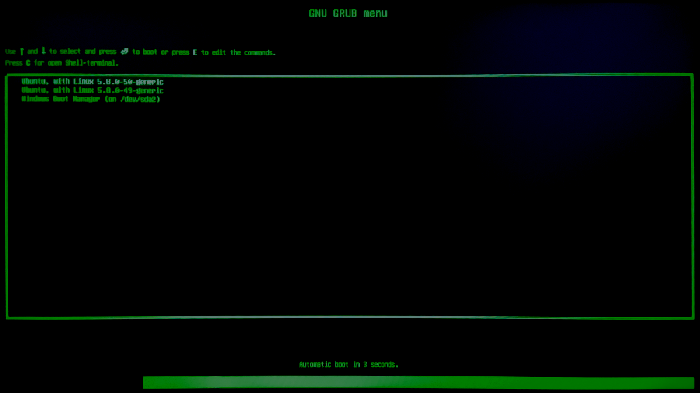

# Decency
**GRUB 2 theme**

## 🚩 Description
As the name suggests this theme for bootloader is simple, sober and efficient 

## ℹ️ Installation 
1. extract all files into "/boot/grub/themes/decency/"
2.  edit the file "/etc/default/grub" and change/add following lines
	 - GRUB_GFXMODE=1920x1080
	 - GRUB_THEME="/boot/grub/themes/descent/theme.txt"
3. run "update-grub" with root-previlegs (on Ubuntusystems use "sudo update-grub")
4. reboot
5. look at your new awesome Bootmenu

## 📝 Note
 - It works properly with a resolution of 1920x1080.
 - Be sure that your graphics-Resolution is able to use it  by running the command "vbeinfo" at grub-shell.
 -  The font used is "Unifont" a free unicode font. 

## 📜 History
 - Origin:
	- first modifications made by N-z0 in december 2015 .
	
 - Development:
	- last edit on march 2021 by N-z0

## ❤️ Special thanks
This theme is based on "Descent" theme published for download on internet.

